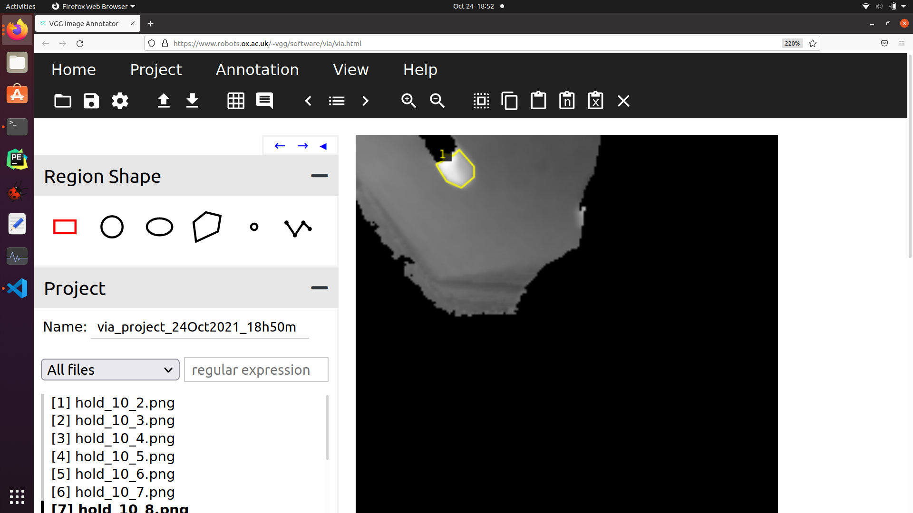

#How to annotate

##The below are instructions for annotating bouldering holds in an image. 

https://github.com/michhar/maskrcnn-custom

Follow the instructions that you'll see in the README in the link above.
The README says to download VGG but there is no need. 
Just go to the link below and you can do the annotations without any installation. 

https://www.robots.ox.ac.uk/~vgg/software/via/via.html

An example of annotation will look like this: 

## Note:
Zooming into the image will make annotating much easier. 
If there is no clearly recognizable bouldering hold it is okay to skip the image. 
Please be careful not to refresh or go back in your browser since you will lose all annotations you have done. 

When you are done with annotating all image, export annotations as instructed in the README. This will download a json file to your Downloads folder. Please move this to inside the folder and send the file back to me. 

